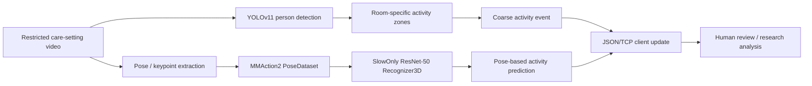
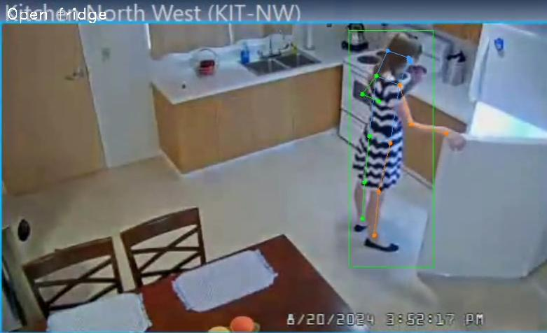
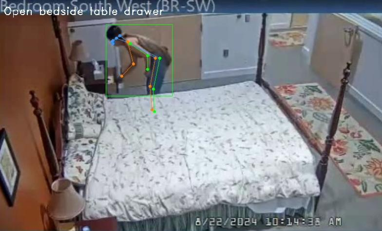
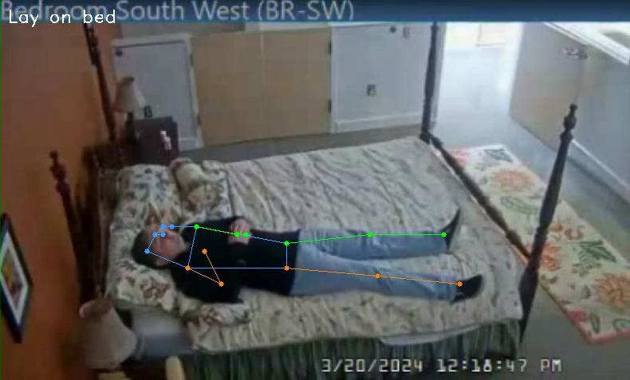
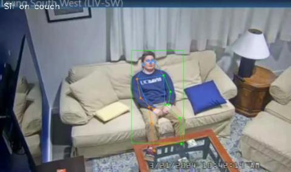
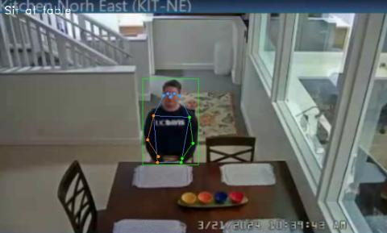

# N.O. H.A.R.M.S.

> **Non-Obtrusive Human Activity Recognition in Medical Settings** - a research prototype for recognizing patient-room activities from pose-derived video representations.


## Overview

N.O. H.A.R.M.S. explored non-obtrusive human activity recognition for long-term-care settings. The project evaluated two complementary research paths: a YOLOv11-backed, rule-based pipeline for coarse location-dependent actions, and a pose/keypoint-based MMAction2 action-recognition pipeline. The intended research direction was to support review of events such as falls, missed medication, and irregular movement - not to make clinical decisions autonomously.

The recovered artifacts include the action labels and a SlowOnly ResNet-50 training configuration. Raw videos, processed annotations, and model weights are intentionally excluded because they may be governed by the source dataset's access terms and could contain sensitive health-related imagery.

## Research scope



The recovered configuration uses `Recognizer3D` with a `ResNet3dSlowOnly` backbone and pose heatmap inputs. The historical report describes YOLOv11 person detection combined with manually defined activity zones for coarse actions, while PoseC3D via MMAction2 was explored for location-independent, pose-based recognition.

## Staged demo outputs

The following stills are student-recorded demonstration samples supplied for public portfolio use. They are not patient footage, clinical records, or a release of the underlying training dataset. Each frame illustrates a detected person, estimated pose keypoints, and the associated activity label.

| Open fridge | Open bedside drawer | Lay on bed |
| --- | --- | --- |
|  |  |  |

| Sit on couch | Sit at table |
| --- | --- |
|  |  |

## Recovered configuration

| Area | Recovered setting |
| --- | --- |
| Classes | 10 activity categories |
| Input | 17-keypoint pose representation |
| Temporal sampling | 48 frames per clip |
| Backbone | SlowOnly 3D ResNet-50 |
| Training | SGD, cosine learning-rate schedule, 240 epochs |
| Training batch size | 8 |
| Evaluation | Top-1 accuracy metric |
| Recovered checkpoint | `best_acc_top1_epoch_89.pth` was supplied, but is intentionally not published |

See [the recovered configuration](configs/slowonly_r50_8xb32-u48-240e_k400-keypoint.py) and [reproducibility notes](docs/reproducibility.md).

## Historical evaluation results

The following results are reported in the team final report. They are retained with their evaluation scope and are not newly reproduced by this repository.

| System | Evaluation scope | Reported result |
| --- | --- | --- |
| PoseC3D via MMAction2 | 30 unseen validation and test videos | Top-1 accuracy: 66.67%; Top-5 accuracy: 83.33% |
| YOLOv11 rule-based activity annotation | Five videos; event timestamps compared with manually annotated ground truth using a 10-second window | Precision: 0.70; Recall: 0.74; F1: 0.72 |
| YOLOv11 rule-based activity annotation | Aggregate result described in the report | 88% action-annotation accuracy; about 5 seconds time error |

The report attributes many pose-based errors to low resolution, motion blur, occlusion, and confusion between visually similar actions. See [evaluation notes](docs/evaluation.md) for scope, caveats, and the recovered event counts.

## Contribution

Yanning Xu contributed to the PoseC3D/MMAction2 action-recognition path: setting up the model, configuring training parameters, extracting pose keypoints during video preprocessing, and preparing action labels and training-ready dataset inputs.

## Activity taxonomy

The recovered `labels.txt` defines the following classes:

| # | Activity |
| ---: | --- |
| 1 | Open fridge |
| 2 | Open bedside table drawer |
| 3 | Sit at table |
| 4 | Sit at desk |
| 5 | Lay on bed |
| 6 | Sit on couch |
| 7 | Open cupboard |
| 8 | Sit on bed |
| 9 | Pick up book |
| 10 | Room transitions |

The historical final report refers to a nine-category manually labeled PoseC3D experiment, while the recovered `labels.txt` contains ten entries. This repository preserves the recovered label file as-is and treats the two class lists as related but distinct experiment iterations.

## Repository layout

```text
configs/       Recovered MMAction2 training configuration
labels.txt     Recovered activity-label vocabulary
docs/          Model card, governance notes, and reproduction guidance
data/          Placeholder only - no dataset or annotations are versioned
models/        Placeholder only - no weights are versioned
```

## Responsible use

This repository is a retrospective academic artifact, not a clinical product. It must not be used for diagnosis, treatment, surveillance without consent, or automated patient-risk decisions. Any renewed work requires institutional approval, valid dataset authorization, de-identification review, bias and error analysis, and a human-in-the-loop escalation policy.

Read the [model card](docs/model-card.md) and [data-governance notes](docs/data-governance.md) before requesting data or reproducing a run.

## What is intentionally excluded

- Raw training video archive (120 videos, supplied separately)
- Processed skeleton annotations and train/validation split files
- Best checkpoint weights
- Patient-facing examples, predictions, and identifiable media
- Credentials, dataset-access instructions, or source-dataset redistribution material

## Known limitations

The recovered artifacts do not include a metric log, evaluation report, dataset split manifest, pose-extraction scripts, or exact environment lockfile. As a result, this repository does **not** report accuracy, clinical validity, or comparative benchmarks. A checkpoint filename indicates a best top-1 checkpoint at epoch 89, but does not establish the score without the original log.

## Citation and attribution

This project was associated with the University of California, Davis and used Dr. Weakley's ICARE dataset under the applicable project access arrangement. Do not redistribute the dataset or derived artifacts without permission from the data owner and the relevant institution.
